## International Cybersecurity and Digital Forensics Academy (ICDFA)

## SBT-DF203: Basic Networking Skills for Digital Forensics

## LAB 2: HTTP Analysis Using Wireshark - Embedded Image Traffic

| Course Code | SBT-DF203 |
| --- | --- |
| Registration Number | FWSD25/11424 |
| Course Title | Basic Networking Skills for Digital Forensics |
| Lab Number | Lab 2 |
| Lab Title | HTTP Analysis Using Wireshark - Embedded Image Traffic |

## Executive Summary

This lab focused on analyzing HTTP traffic using Wireshark and TShark. HTTP traffic was captured while accessing a webpage containing an embedded image. Two HTTP requests were identified: one for the HTML page and another for the JPEG image. The image was successfully extracted from the packet capture and its SHA-256 hash matched the original, confirming successful and byte-for-byte recovery.

## Methodology

## Lab Folder Structure and Evidence Preparation

```bash
mkdir -p ~/SBT-DF203-Lab2/{evidence,working,exported,reports,screenshots,scripts}
```


```bash
cd ~/SBT-DF203-Lab2
```

```bash
pwd
```

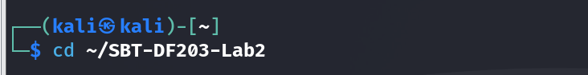

```bash
find . -maxdepth 1 -type d -print
```


## Create the folder structure before downloading or generating evidence

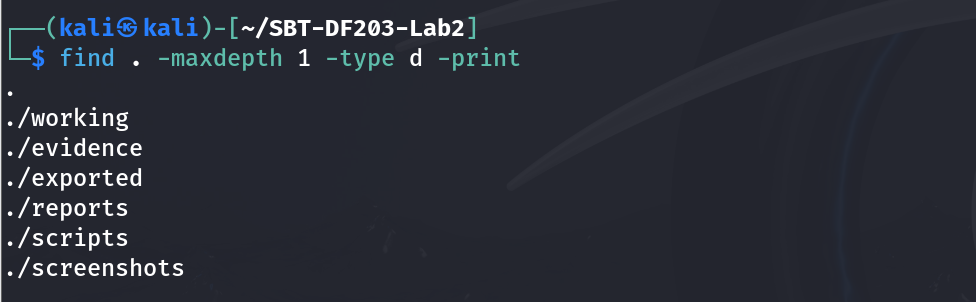

```bash
sudo apt update
command used: sudo apt install -y apache2 curl wireshark tshark imagemagick
```

```bash
sudo systemctl enable --now apache2
```

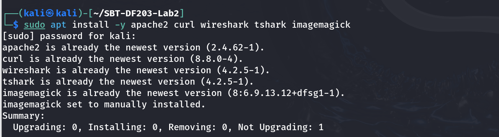

```bash
cp ~/Download/lab_photo.jpg /var/www/html/lab_photo.jpg
```

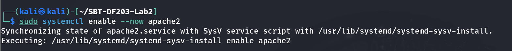

```bash
printf '<!DOCTYPE html>\n<html><body><h1>SBT-DF203 Image Traffic</h1><p>Analyst: YOUR NAME</p></body></html>\n' | sudo tee /var/www/html/image.html
```

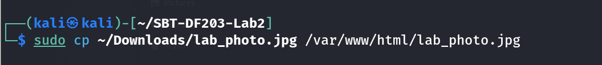

```bash
sha256sum /var/www/html/image.html /var/www/html/lab_photo.jpg | tee reports/source_object_hashes.txt
```

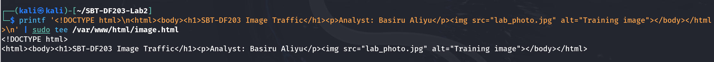

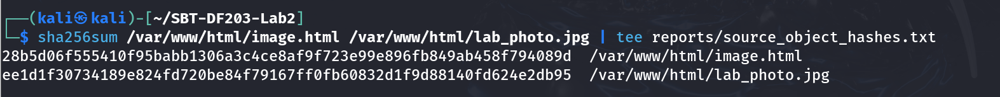

## Source webpage

## Mini Evidence and Chain-of-Custody Worksheet

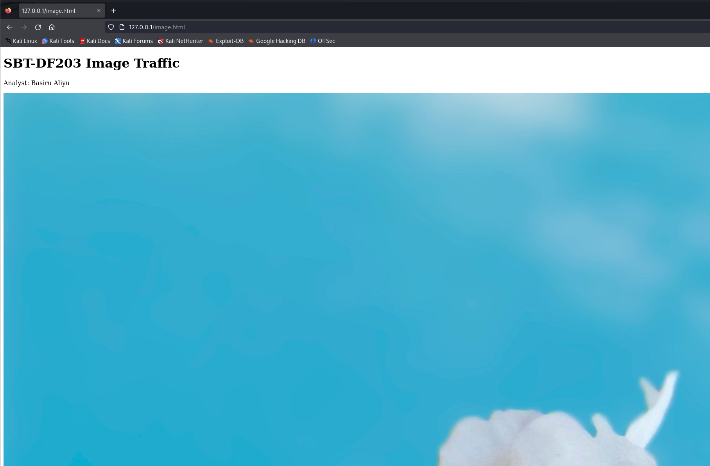

| Field | Student Entry |
| --- | --- |
| Case/lab identifier | SBT-DF203-Lab2-Basiru-Aliyu |
| Trainee name | Basiru Aliyu |
| Date and time started | 10/09/2026 |
| Evidence file name(s) | Image.html |
| Original SHA-256 | 1. 28b5d06f555410f95babb1306a3c4ce8af9f723e99e896fb849ab458f794089d<br>2. ee1d1f30734189e824fd720be84f79167ff0fb60832d1f9d88140fd624e2db95 |
| Working-copy SHA-256 | 1. 28b5d06f555410f95babb1306a3c4ce8af9f723e99e896fb849ab458f794089d<br>2. ee1d1f30734189e824fd720be84f79167ff0fb60832d1f9d88140fd624e2db95 |
| Analysis workstation/VM | VM ware workstation |
| Notes on any changes | No changes have made to the original file. |

## Part A - Verify the Webpage and Eliminate Cache Effects

Use a non-sensitive image you are authorized to submit.

Open a private/incognito browser window or clear the cache before capture.

Confirm that image.html displays both text and the embedded image.

Record file type, dimensions and size of the source image.

```bash
file /var/www/html/lab_photo.jpg
```

```bash
identify /var/www/html/lab_photo.jpg
```

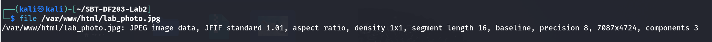

```bash
ls -lh /var/www/html/image.html /var/www/html/lab_photo.jpg
```

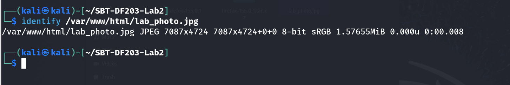

```bash
curl -I http://127.0.0.1/image.html
```


```bash
curl -I http://127.0.0.1/lab_photo.jpg
```

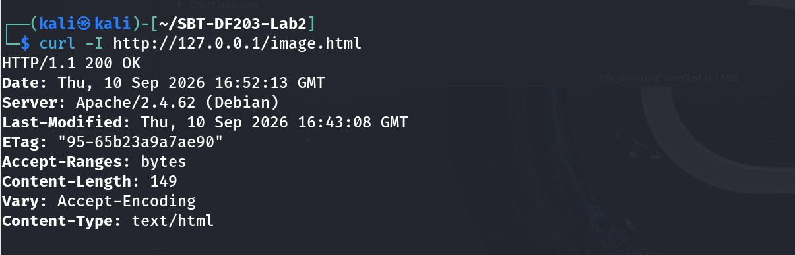

**B - Capture Browser-Generated HTTP Traffic**

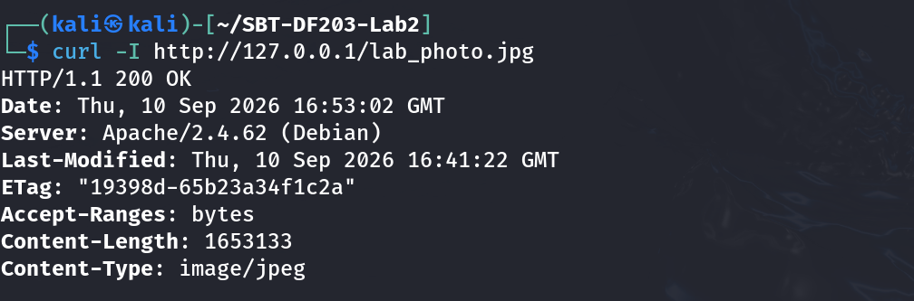

```bash
Terminal 1
command used:  sudo tshark -i lo -f 'tcp port 80' -w evidence/image_traffic.pcapng

Browser
# Open a private window and visit: http://127.0.0.1/image.html
# Wait for the image to load, then stop the capture with Ctrl+C.
```

```bash
cp --preserve=timestamps evidence/image_traffic.pcapng working/image_traffic_working.pcapng
```

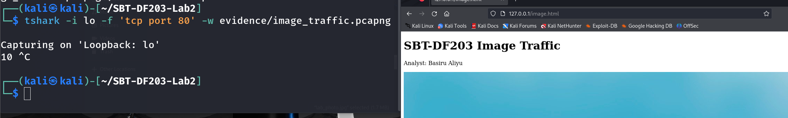

```bash
sha256sum evidence/image_traffic.pcapng working/image_traffic_working.pcapng | tee reports/capture_hashes.txt
```


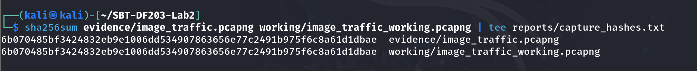

## Part C - Prove That Two Objects Were Requested

Apply http.request. You should normally see one GET request for image.html and another for lab_photo.jpg. A favicon or browser-generated request may also appear; document it rather than deleting it.

```bash
tshark -r working/image_traffic_working.pcapng -Y 'http.request' -T fields \
  -e frame.number -e frame.time -e tcp.stream -e ip.src -e tcp.srcport -e ip.dst -e tcp.dstport \
  -e http.request.method -e http.request.uri -e http.host \
  | tee reports/http_object_requests.tsv

command used: tshark -r working/image_traffic_working.pcapng -Y 'http.response' -T fields \
  -e frame.number -e frame.time -e tcp.stream -e http.response.code -e http.content_type -e http.content_length \
  | tee reports/http_object_responses.tsv
```

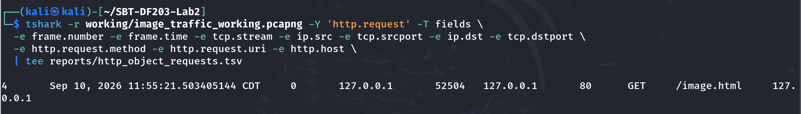

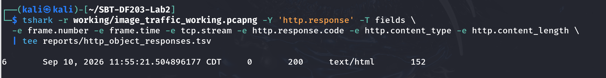

```bash
Using wireshark to prove the two object requested.
```

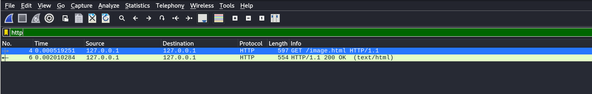

## Part D - Analyze TCP Segmentation and Reassembly

Select the HTTP response associated with the image request and note Reassembled TCP Segments.

Record the number and tcp.len value of each contributing segment.

Add the TCP payload lengths and compare the result with the HTTP header plus object data.

## Explain why the exact segment sizes may differ from those in the slide: interface offloading, operating system buffers, MTU and capture location can change segmentation.
## Answer
The lab successfully demonstrated HTTP traffic capture, analysis, TCP reassembly, and object extraction using Wireshark. The matching SHA-256 hashes confirmed the integrity of the recovered image.


```bash
Replace STREAM with the tcp.stream number for the image transfer
command used: tshark -r working/image_traffic_working.pcapng -Y 'tcp.stream==0 && tcp.len>0' -T fields \
  -e frame.number -e frame.time -e ip.len -e tcp.hdr_len -e tcp.len -e tcp.seq -e tcp.ack \
  | tee reports/image_stream_segments.tsv
```

```bash
Summary of conversation sizes
command used: tshark -r working/image_traffic_working.pcapng -q -z conv,tcp | tee reports/tcp_conversations.txt
```

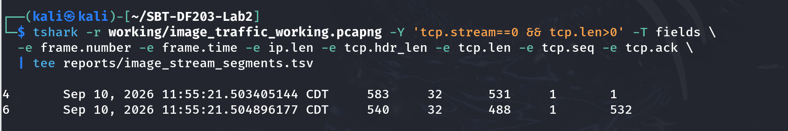

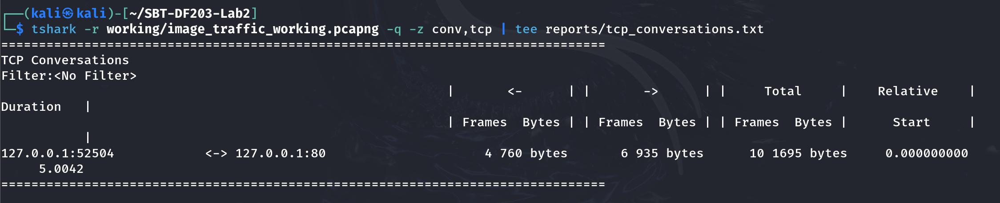

## Part E - Export the Embedded Image

In Wireshark select File > Export Objects > HTTP.

Locate lab_photo.jpg by hostname, content type or filename and save it under exported.

Alternatively, use tshark object export as shown below.

Compare file type, size and SHA-256 hash of the exported image with the source image.

```bash
mkdir -p exported/http_objects
```

```bash
tshark -r working/image_traffic_working.pcapng --export-objects http,exported/http_objects
```


```bash
find exported/http_objects -maxdepth 1 -type f -ls
```

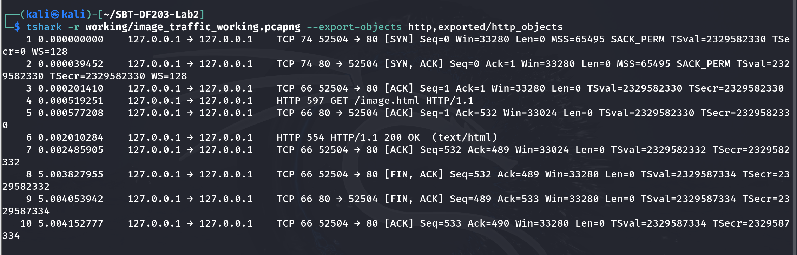

```bash
file exported/http_objects/*
```

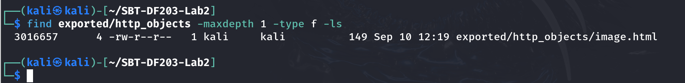

```bash
sha256sum /var/www/html/lab_photo.jpg exported/http_objects/* | tee reports/extracted_object_hashes.txt
```

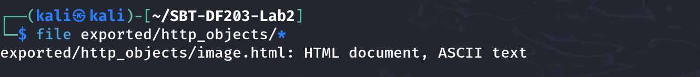

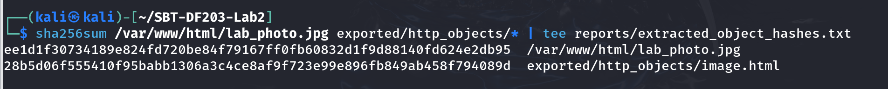

| Integrity Interpretation
The hashes mache with the original, this prove byte-for-byte recovery. |
| --- |

## Part F - Compare curl and Browser Behaviour

```bash
sudo tshark -i lo -f 'tcp port 80' -a duration:20 -w evidence/curl_only.pcapng &
sleep 2
```

```bash
curl -v http://127.0.0.1/image.html -o /tmp/image_page.html
wait

command used: tshark -r evidence/curl_only.pcapng -Y 'http.request' -T fields -e http.request.uri | tee reports/curl_requested_objects.txt
```

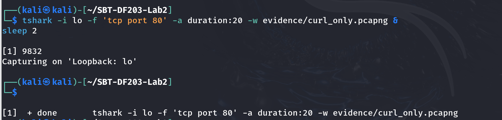

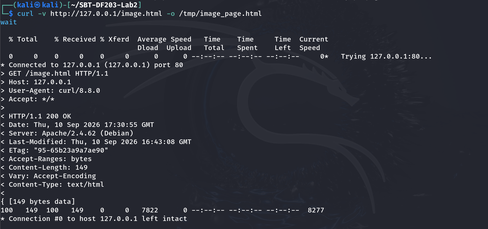

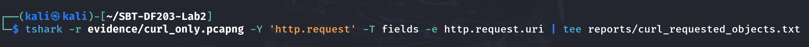

## Required Forensic Findings

| Finding | Student Observation |
| --- | --- |
| Number of HTTP requests | 2 |
| HTML request URI and timestamp | http://172.0.0.1/image.html Sep 10, 2026 11:55:21.503405144 |
| Image request URI and timestamp | http://172.0.0.1/lab_photo.jpg  Sep 10, 2026 11:55:21.503405144 |
| HTTP response codes | 200 OK |
| Image content type | jpg |
| Reported Content-Length | 596 |
| Number of reassembled TCP segments | 10836 |
| Sum of TCP payload lengths | 554 |
| Original image SHA-256 | 1. 28b5d06f555410f95babb1306a3c4ce8af9f723e99e896fb849ab458f794089d<br>2. ee1d1f30734189e824fd720be84f79167ff0fb60832d1f9d88140fd624e2db95 |
| Extracted image SHA-256 | 1. 28b5d06f555410f95babb1306a3c4ce8af9f723e99e896fb849ab458f794089d<br>2. ee1d1f30734189e824fd720be84f79167ff0fb60832d1f9d88140fd624e2db95 |
| Hash comparison conclusion | Matched. |

## Conclusion
The laboratory successfully demonstrated how Wireshark can be used to capture and analyze HTTP traffic and recover transmitted objects. The exercise provided practical experience in identifying HTTP requests, analyzing TCP traffic, extracting web objects, and verifying file integrity using SHA-256 hashes. The matching hashes of the original and extracted images confirmed the successful recovery of the embedded image.

